# STM32F407VETx-st7920-graphics

STM32F407VET6 environment graphics — ST7920 128x64 LCD + XY-MD02 temperature & humidity sensor via RS485 Modbus RTU.

---

## Hardware

| Component | Description |
|-----------|-------------|
| MCU | STM32F407VET6 (LQFP100) |
| Display | ST7920 128x64 LCD |
| Sensor | XY-MD02 Temperature & Humidity (RS485 Modbus RTU) |
| RS485 | RS485-to-TTL converter module (auto direction) |

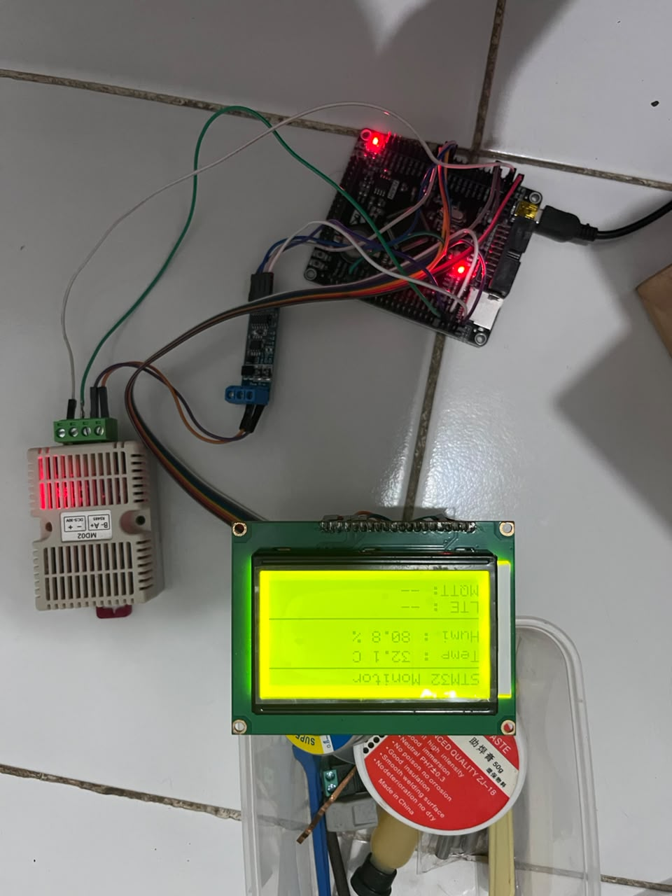

---

## Pinout

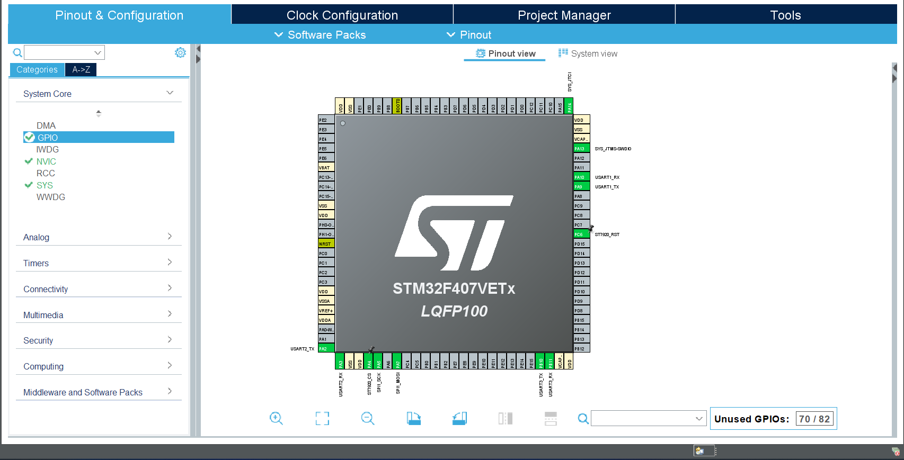

### ST7920 LCD — SPI1

| Signal | STM32 Pin | Mode |
|--------|-----------|------|
| CLK (E) | PA5 | SPI1_SCK |
| SID (R/W) | PA7 | SPI1_MOSI |
| CS (RS) | PA4 | GPIO Output |
| RST | PC6 | GPIO Output |
| PSB | GND | Serial mode enable |

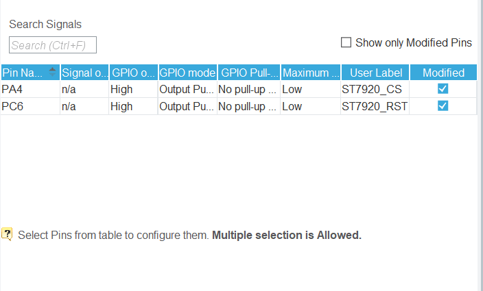
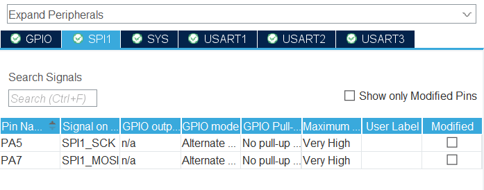

### XY-MD02 Sensor — USART2 via RS485-TTL

| Signal | STM32 Pin | Mode |
|--------|-----------|------|
| TX | PA2 | USART2_TX |
| RX | PA3 | USART2_RX |

RS485 converter wiring:
```
STM32 PA2 (TX) → RS485 module DI/TX
STM32 PA3 (RX) → RS485 module RO/RX
RS485 module A → XY-MD02 A+
RS485 module B → XY-MD02 B-
XY-MD02 Power  → 7-30V (external supply)
GND STM32      → GND power supply (common ground wajib)
```
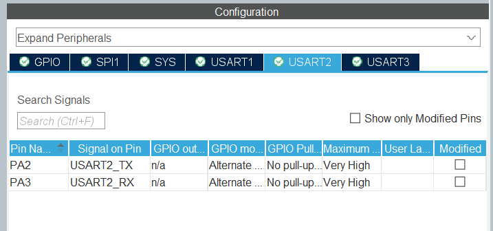

### USART1 — Debug

| Signal | STM32 Pin |
|--------|-----------|
| TX | PA9 |
| RX | PA10 |

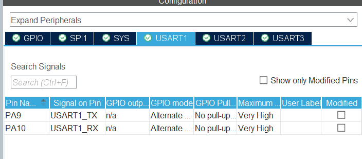

---

## Clock Configuration

HSE crystal tidak tersedia di board — menggunakan HSI internal.

| Parameter | Value |
|-----------|-------|
| Clock source | HSI 16 MHz |
| PLLM | 16 |
| PLLN | 336 |
| PLLP | /4 |
| SYSCLK | 84 MHz |
| HCLK | 84 MHz |
| APB1 (USART2) | 42 MHz |
| APB2 (USART1, SPI1) | 84 MHz |

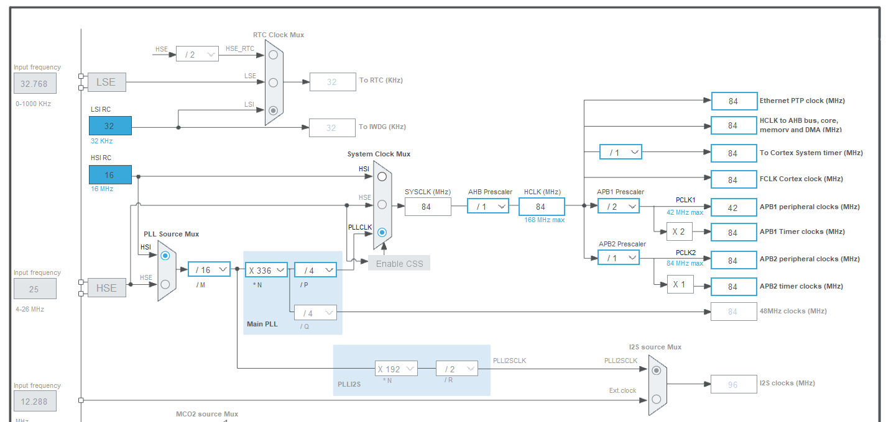

---

## SPI1 Configuration

| Parameter | Value | Note |
|-----------|-------|------|
| Mode | Transmit Only Master | ST7920 write-only |
| Prescaler | 128 | 84MHz/128 = ~656KHz |
| CPOL | High | SPI Mode 3 |
| CPHA | 2 Edge | SPI Mode 3 |
| NSS | Software | CS dikontrol manual PA4 |
| First Bit | MSB | |

> Prescaler 128 diperlukan karena HSI kurang stabil dibanding HSE untuk SPI timing ST7920.

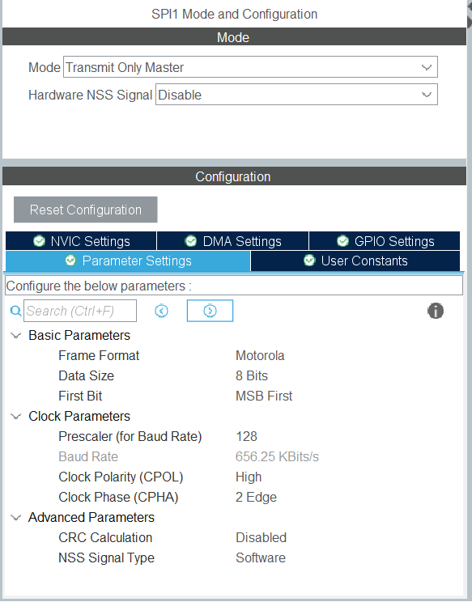

---

## USART Configuration

| Peripheral | Baud Rate | Usage |
|-----------|-----------|-------|
| USART1 | 115200 | Debug print |
| USART2 | 9600 | XY-MD02 Modbus RTU |

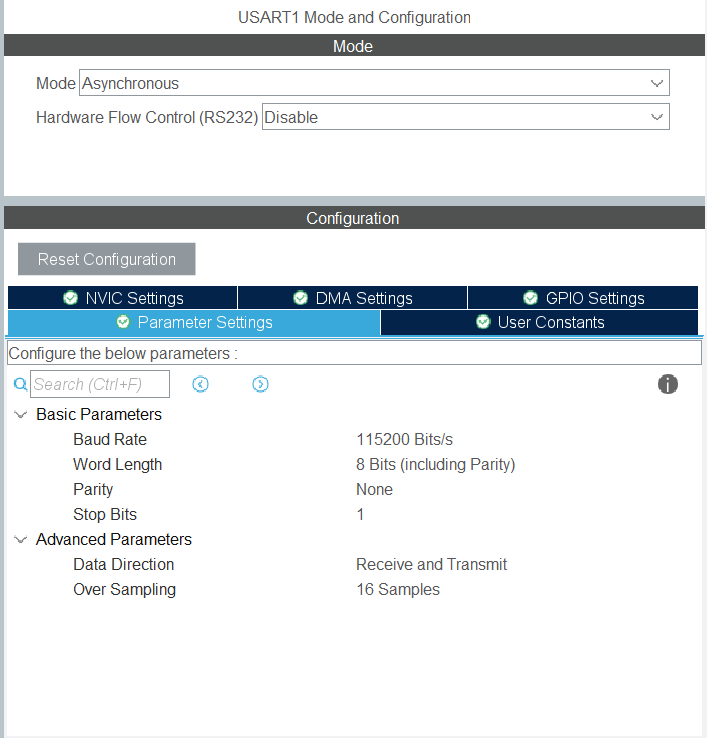
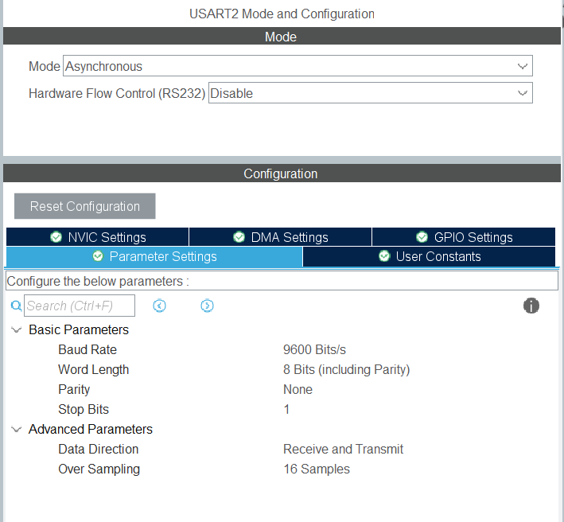
---

## Software Stack

| Layer | Technology |
|-------|-----------|
| RTOS | FreeRTOS CMSIS-V2 |
| HAL | STM32 HAL F4 |
| IDE | STM32CubeIDE |

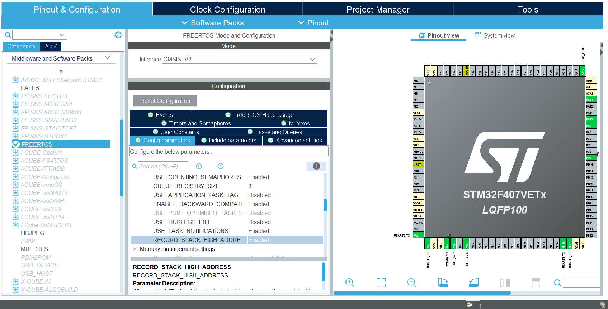
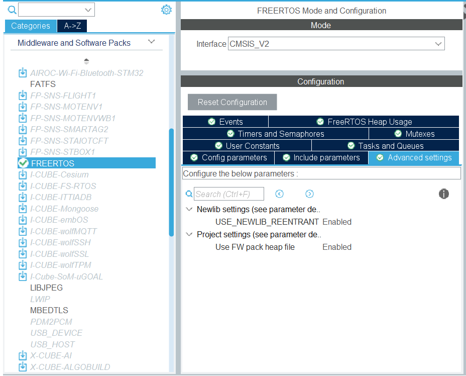

### FreeRTOS Tasks

| Task | Priority | Stack | Interval |
|------|----------|-------|----------|
| `display_task` | Normal | 512×4 | 500ms |
| `sensor_task` | Above Normal | 512×4 | 5000ms |

### Queue

```
sensor_task → [sensor_queue: 1x sensor_data_t] → display_task
```

---

## File Structure

```
Core/
├── Inc/
│   ├── main.h
│   ├── st7920.h        ← ST7920 driver header
│   └── sensor.h        ← XY-MD02 driver header
└── Src/
    ├── main.c          ← Application entry + FreeRTOS tasks
    ├── st7920.c        ← ST7920 driver (HW SPI1)
    └── sensor.c        ← XY-MD02 Modbus RTU driver
```

---

## Display Layout

```
┌────────────────────────────┐
│ STM32 Monitor              │  ← row 0
│────────────────────────────│  ← row 10
│ T: 31.8 C                  │  ← row 14
│ H: 74.3 %                  │  ← row 26
│────────────────────────────│  ← row 40
│ Sensor: OK                 │  ← row 44
│ LTE   : --                 │  ← row 54
└────────────────────────────┘
```

---

## Known Issues & Notes

| Issue | Status | Note |
|-------|--------|------|
| HSE crystal tidak jalan | Resolved | Ganti ke HSI PLL |
| SPI terlalu cepat — display hancur | Resolved | Prescaler 128 |
| XY-MD02 intermittent | Resolved | Double flush + HAL_Delay(100) setelah TX |

---

## Result

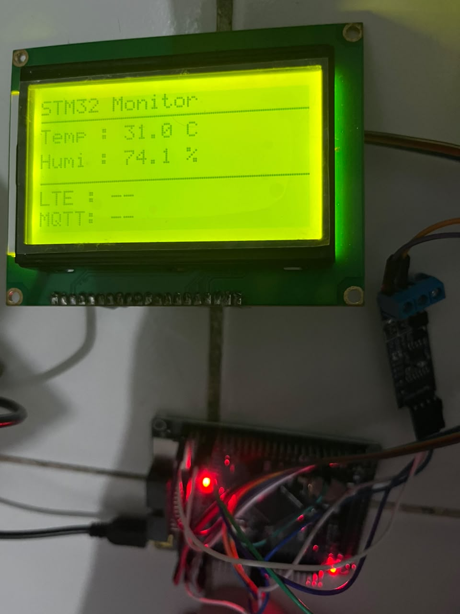

---

## References

- [U8g2 Library](https://github.com/olikraus/u8g2) — ST7920 driver logic adapted from U8g2
